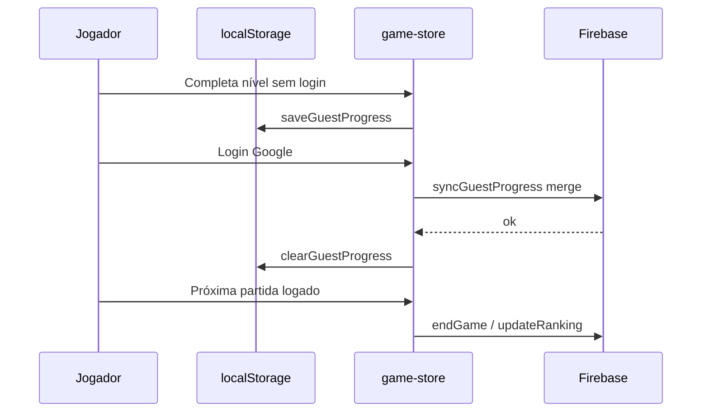

# Modo convidado offline + sync no login

## Situação atual

O produto já permite navegar sem login ([README](README.md)), mas a implementação está incompleta:

| Área                                    | Problema                                                                                                                                   |
| --------------------------------------- | ------------------------------------------------------------------------------------------------------------------------------------------ |
| Progresso                               | Só persiste em Firebase (`ranking/{uid}`) quando `getUser` existe                                                                          |
| Convidado em `/partida`                 | [`getUserCurrentLevelUnlock()`](src/stores/game-store.ts) acessa `useUser.getUser.uid` sem guard → erro ou retorno `0` bloqueia níveis     |
| [`endGame()`](src/stores/game-store.ts) | Ignora convidado — pontuação da partida não é salva                                                                                        |
| Níveis offline                          | [`getLevels()`](src/stores/game-store.ts) retorna `[]` se Firebase falhar — partida quebra sem rede                                        |
| UI                                      | Aviso em [`ChooseLevelPage.vue`](src/pages/ChooseLevelPage.vue) usa `v-if="user"` (invertido) e diz que login é necessário para conquistas |
| Login                                   | [`loginWithGoogle()`](src/stores/user-store.ts) cria ranking zerado; não lê progresso local                                                |

```mermaid
flowchart TD
  subgraph hoje [Hoje]
    Play[Play sem login] --> Choose[/escolher-nivel]
    Choose --> Partida[/partida]
    Partida --> Unlock{getUser.uid}
    Unlock -->|null| Erro[Bloqueio/erro]
    Partida --> End[endGame]
    End -->|sem user| Perda[Pontos perdidos]
  end

  subgraph alvo [Alvo]
    Play2[Play sem login] --> Local[localStorage memorix_guest_progress]
    Local --> Partida2[/partida]
    Login[Login Google] --> Merge[Mesclar local + Firebase]
    Merge --> Cloud[ranking/uid]
    Merge --> Clear[Limpar chave guest]
  end
```

## Arquitetura proposta

### 1. Camada de persistência local

Criar [`src/services/guest-storage.ts`](src/services/guest-storage.ts) com:

- **Chave:** `memorix_guest_progress`
- **Modelo** (alinhado ao `Ranking` existente):

```ts
interface GuestProgress {
  score: number;
  gameTotal: string; // "MM:SS" acumulado (mesmo formato do Firebase)
  attemptCounter: number;
  currentLevel: number; // maior nível desbloqueado (mín. 1 para novo jogador)
}
```

- Funções: `loadGuestProgress()`, `saveGuestProgress()`, `clearGuestProgress()`, `getDefaultGuestProgress()` (`currentLevel: 1`, demais zerados)
- **Cache de níveis (offline):** chave `memorix_levels_cache` — gravar após `getLevels()` bem-sucedido; ler quando Firebase falhar

Reutilizar tipos em [`src/types/game.ts`](src/types/game.ts) (`GameScore` / exportar `GuestProgress`).

### 2. Abstração de progresso no `game-store`

Refatorar três actions em [`src/stores/game-store.ts`](src/stores/game-store.ts) para delegar a **local** ou **Firebase** conforme `useUser.getUser`:

| Action                              | Convidado (offline/online sem login)                     | Logado                                                         |
| ----------------------------------- | -------------------------------------------------------- | -------------------------------------------------------------- |
| `getUserCurrentLevelUnlock()`       | `loadGuestProgress().currentLevel` (default `1`)         | Firebase `ranking/{uid}/currentLevel` (default `1` se ausente) |
| `updateUserCurrentLevelIfAdvance()` | `saveGuestProgress` com `max(atual, nextLevel)`          | `update` no Firebase (como hoje)                               |
| `endGame()`                         | Acumular `score`, `attemptCounter`, `gameTotal` no local | `updateRanking` no Firebase (como hoje)                        |

**`getLevels()`** — ordem de fallback:

1. Firebase (se online)
2. `memorix_levels_cache`
3. [`balancedLevels`](src/model/levels.ts) embutido no bundle

### 3. Sync no login (estratégia escolhida: mesclar)

Em [`src/stores/user-store.ts`](src/stores/user-store.ts), após `setUser(user)` em `loginWithGoogle()`:

1. Ler `guest = loadGuestProgress()` — se vazio, encerrar
2. Buscar `remote` em `ranking/{uid}`
3. Se não existir ranking: `addRaking` com dados do guest + perfil Google
4. Se existir: mesclar e `update` uma vez:
   - `currentLevel = max(remote, guest)`
   - `score = remote.score + guest.score`
   - `attemptCounter = remote.attemptCounter + guest.attemptCounter`
   - `gameTotal`: somar minutos/segundos de ambos (helper dedicado, pois hoje `updateRanking` usa `+` em strings de forma frágil)
5. `clearGuestProgress()` após sync bem-sucedido
6. Em falha de rede: manter guest local e exibir notify (Quasar) para tentar login novamente

Nova action: `syncGuestProgressToAccount(uid: string): Promise<void>`.

**Novo usuário Firebase:** incluir `currentLevel: 1` em `addRaking` para alinhar com convidado.

### 4. Ajustes de UI e copy

| Arquivo                                                                 | Mudança                                                                                                                                                                      |
| ----------------------------------------------------------------------- | ---------------------------------------------------------------------------------------------------------------------------------------------------------------------------- |
| [`ChooseLevelPage.vue`](src/pages/ChooseLevelPage.vue)                  | `v-if="!user"` — aviso: progresso salvo localmente; login sincroniza com a nuvem. Remover `unlockedLevels = 10` demo; inicializar com `1` até `onMounted` carregar progresso |
| [`ModalChooseLevel.vue`](src/components/organisms/ModalChooseLevel.vue) | Atualizar texto: pontos salvos localmente; classificação global só após login                                                                                                |
| [`IndexPage.vue`](src/pages/IndexPage.vue)                              | Opcional: linha com score/nível local quando convidado (melhora feedback)                                                                                                    |
| [`BtnLoginGoogle.vue`](src/components/atoms/BtnLoginGoogle.vue)         | Notify de sucesso após sync (“Progresso sincronizado”)                                                                                                                       |

Logout continua removendo só `user` — **não** apagar `memorix_guest_progress` (convidado pode voltar a jogar).

### 5. Fluxo offline / online sem login

- **Offline:** níveis via cache ou `balancedLevels`; progresso 100% local
- **Online sem login:** níveis do Firebase + progresso local (sem ranking global até login)
- **Após login:** uma escrita mesclada no Firebase; guest limpo para evitar dupla contagem



## Arquivos principais a alterar

- **Novo:** [`src/services/guest-storage.ts`](src/services/guest-storage.ts)
- **Core:** [`src/stores/game-store.ts`](src/stores/game-store.ts), [`src/stores/user-store.ts`](src/stores/user-store.ts)
- **UI:** [`src/pages/ChooseLevelPage.vue`](src/pages/ChooseLevelPage.vue), [`src/components/organisms/ModalChooseLevel.vue`](src/components/organisms/ModalChooseLevel.vue)
- **Tipos:** [`src/types/game.ts`](src/types/game.ts)
- **Docs:** [`README.md`](README.md) — documentar chaves localStorage e fluxo de sync

## Fora de escopo (nesta entrega)

- Fila de sync offline pós-login (retry automático) — apenas notify em falha
- Ranking global visível para convidado
- PWA/service worker para dados (assets já cobertos no build PWA)
- Refatorar `updateRanking` para contas já logadas (bug pré-existente de soma de `gameTotal` string)

## Plano de testes manual

1. Limpar `localStorage` → jogar nível 1 sem login → verificar `memorix_guest_progress` atualizado
2. Avançar para nível 2 → `/escolher-nivel` mostra nível 2 desbloqueado offline
3. Desligar rede → abrir app → níveis e partida funcionam (fallback `balancedLevels`/cache)
4. Login Google com conta nova → dados locais aparecem no Firebase; chave guest removida
5. Login em conta com ranking existente → `currentLevel` = max; `score` = soma
6. Logout → jogar de novo como convidado → progresso independente reinicia em local
